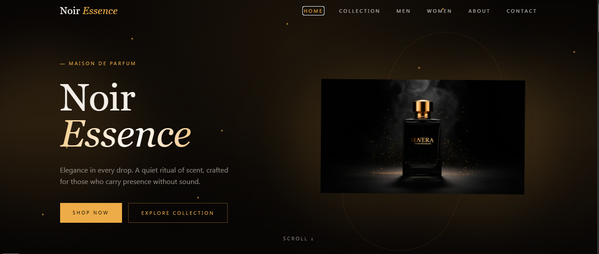
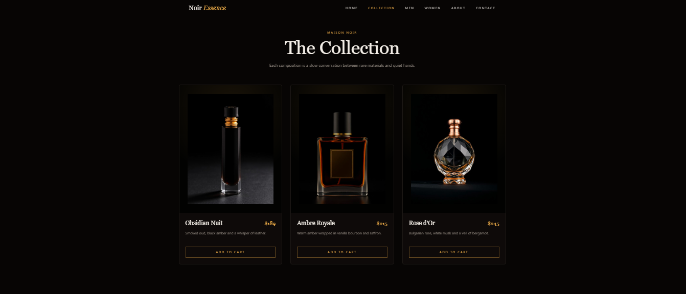
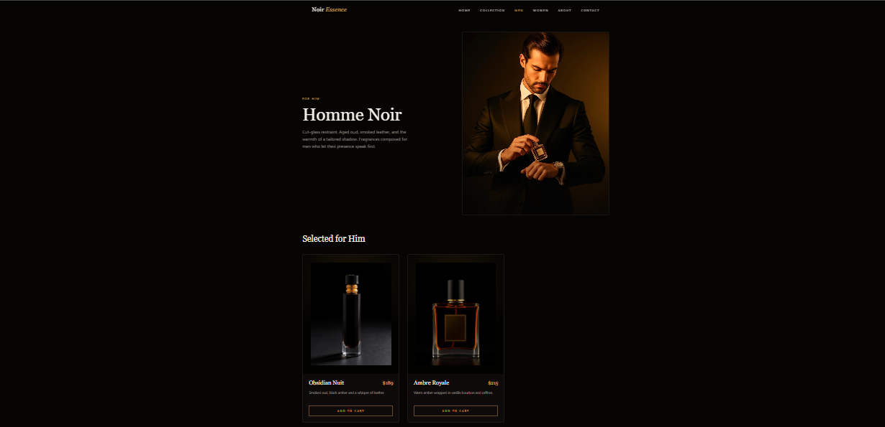
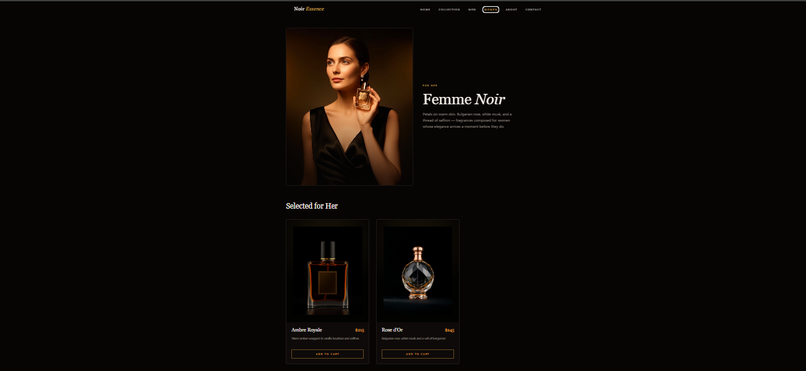
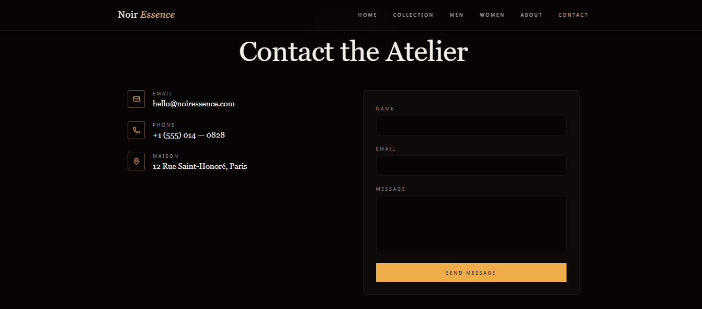

# Noir Essence – AI Generated Perfume Website

## Overview
Noir Essence is a modern and elegant perfume brand website created using AI-powered tools. The project focuses on delivering a luxury aesthetic with a clean layout, smooth design, and visually appealing interface.

## AI Tool Used
Lovable AI

## Prompt Used
The prompt was created with the assistance of ChatGPT to design a modern and aesthetic perfume brand website with a luxury feel, clean layout, and visually appealing sections.

## Features
- Elegant and luxury-inspired design  
- Clean and modern user interface  
- Aesthetic color scheme  
- Hero section with strong visual impact  
- Product showcase section  
- Smooth and structured layout  
- Responsive design  

## Live Website
https://essence-of-noir-style.lovable.app

## Screenshots

## Learnings
- Learned how to create websites using AI tools  
- Improved prompt writing skills  
- Understood modern UI/UX design concepts  
- Gained experience in building aesthetic and professional websites  
